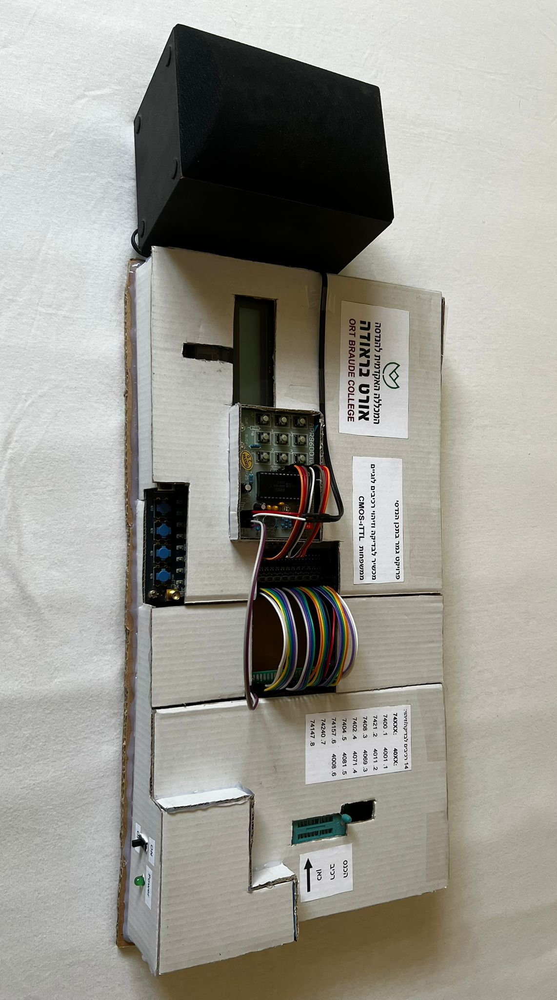
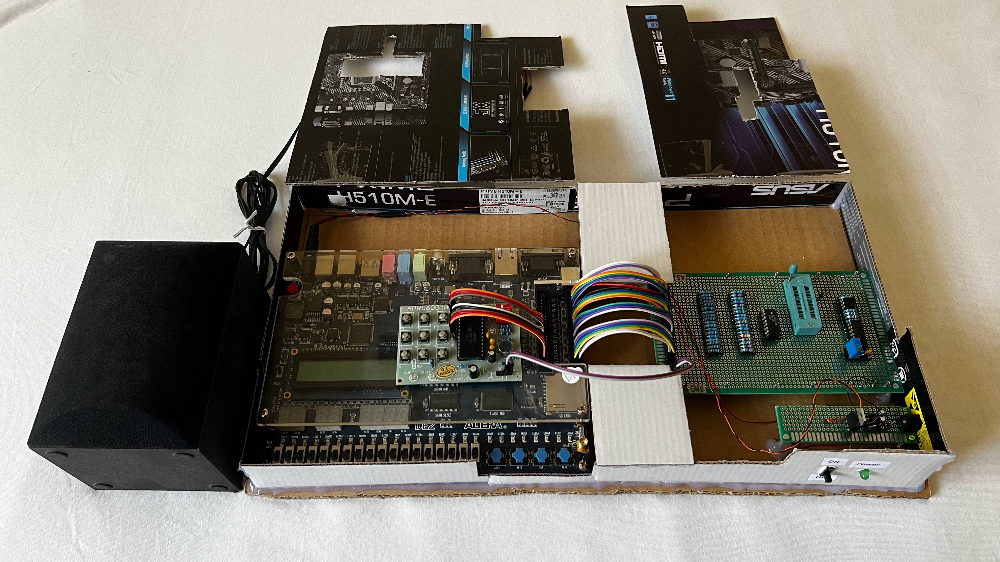

# TTL-CMOS-Components-Checker

Final project in BSC electrical & electronics engineering in Academic College Braude, Karmiel, Israel.

last update: 31/07/22- Submission version

[Demonstration video](https://youtu.be/3ToF3FLL9-4)

## Images of the project

### Project's circuits

## Description

The purpose of this project was to indentify and check TTL/CMOS components (up to 20 pins) using FPGA controller (Altera DE2- Cyclone II FPGA).

The project will display the component's name after identifying it, and can display if the component is faulty.

If the tested component is inserted flipped, the project will alert the user.

The user has a few ways to interface with the project.
* ZIF IC socket 20 pins- for quick and easy instert and pulling of tested components.
* 4 push-buttons on development board- for the user to interact with the project.
* 16X2 LCD display- showing the options the user can pick, testing/indentifying results.
* Sound module APR9600 + speaker- sounds prerecorded voice messages according to the state of the system.
* Red & Green LEDs- lights according to testing/indentifying results

The project can identify and check 8 components from 7400-series (TTL) and 6 components from 4000-series (CMOS).

## Block diagram 

## Schematic of the project

## Operating principle

## Authors

**Dan Neytur** - [DanNeytur](https://github.com/DanNeytur)

## Acknowledgments
* [LCD controller and User Logic in VHDL and Programming a FPGAs
](https://openlab.citytech.cuny.edu/wang-cet4805/files/2017/04/LCD-controller-and-User-Logic-in-VHDL-and-Programming-a-FPGAs_posted.pdf)
* [LCD 16×2 Pinout, Commands, and Displaying Custom Characters](https://www.electronicsforu.com/technology-trends/learn-electronics/16x2-lcd-pinout-diagram)
